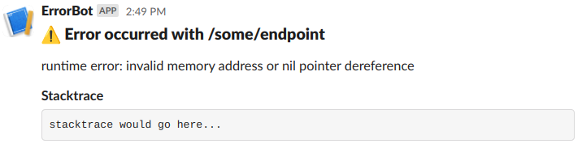

# slack-go
A (very simple) Go library for posting messages to incoming webhooks in Slack.

You will need to set up a Slack App with an incoming webhook URL; see the [developer documentation](https://api.slack.com/messaging/webhooks#getting_started) for details.

## Example
```go
package main

import "github.com/PromptBit/slack-go/slack"

func main() {
	webhookURL := "<add url here>"

	err := slack.PostToWebhook(webhookURL, slack.Message{
		Text: "Error occurred with /some/endpoint",
		Blocks: []slack.Block{
			{
				Type: slack.BlockTypeHeader,
				Text: &slack.Text{
					Type:  slack.TextTypePlainText,
					Text:  ":warning: Error occurred with /some/endpoint",
					Emoji: true,
				},
			},
			{
				Type: slack.BlockTypeSection,
				Text: &slack.Text{
					Type: slack.TextTypePlainText,
					Text: "runtime error: invalid memory address or nil pointer dereference",
				},
			},
			{
				Type: slack.BlockTypeSection,
				Text: &slack.Text{
					Type: slack.TextTypeMarkdown,
					Text: "*Stacktrace*\n```stacktrace would go here...```",
				},
			},
		},
	})

	if err != nil {
		panic(err)
	}
}
```

That code will result in the following being posted to Slack:

